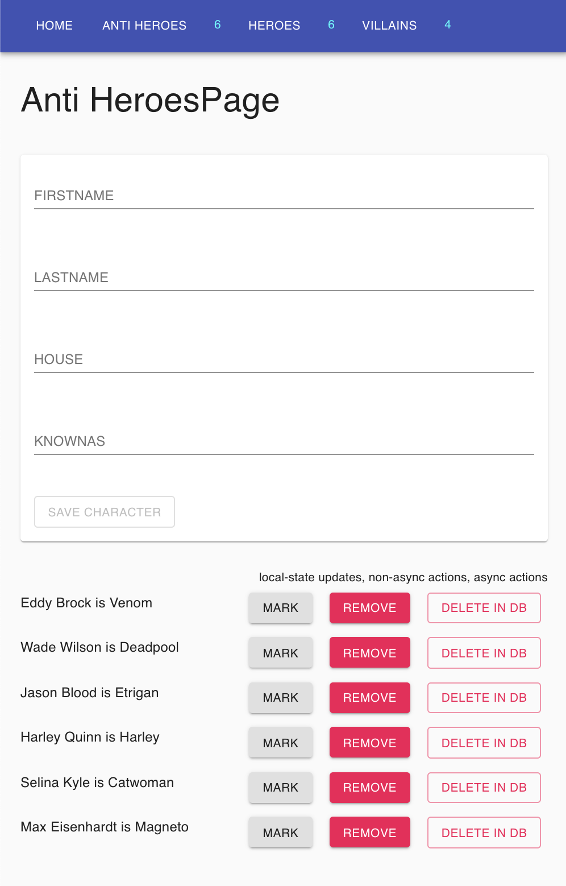

## Redux Query Course with Zustand, Immer, and React Table

#### Tech tools

- https://pnpm.io
- https://vitejs.dev
- https://react-hook-form.com
- https://zod.dev
- https://tailwindcss.com
- https://vitest.dev
- https://playwright.dev

```sh
$ git clone https://github.com/webmasterdevlin/zustand-immer-react-query-course.git
$ cd zustand-immer-react-query-course
$ pnpm install
$ pnpm start
```

#### E2e testing

```sh
$ npx playwright install
$ pnpm test:e2e
```

The React app, and the fake web service will run concurrently.



## Set up React Testing Library and Vitest

- create ./src/test-utils/testing-library-util.tsx that will be a copy of the root component

## Set up MSW for mocking API calls

- pnpm i -D msw
- the msw is a mocking library which will intercept the requests and responses in the integration tests
- create ./src/mocks/handler/todoHandler.ts
- create ./src/mocks/handler/index.ts
- create ./src/mocks/server.ts
- update the ./src/setupTests.ts

## Integration tests

- write integration tests for the fetch todos function of WorkTodosPage.tsx by creating ./src/pages/tests/WorkTodosPage.test.ts
- run the tests, pnpm run test, and see if the todos are rendered

#### React Query persist cache between tests

- the beforeEach does not work

```ts
beforeEach(() => {
  queryClient.clear();
});
```
